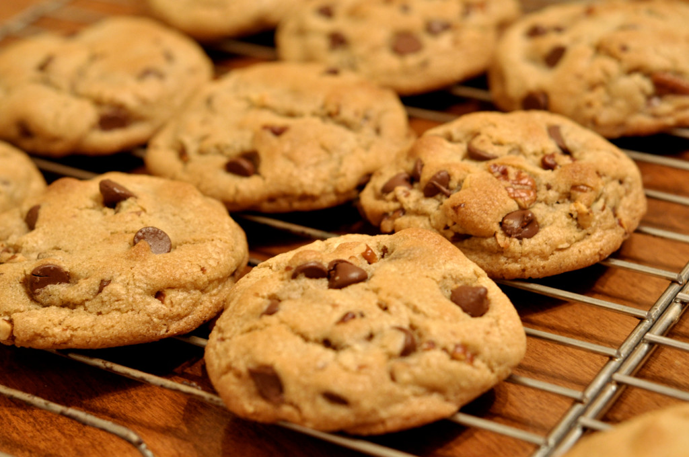
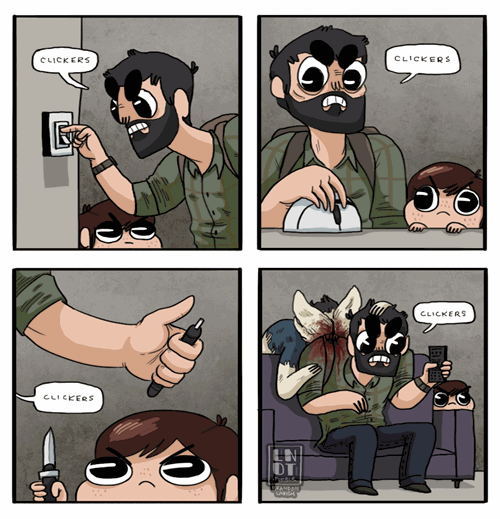

# Cookie Clicker

- Type of challenge: **consolidation**
- Repository: `CookieClicker`
- Duration: **2 days**
- Team challenge: **4**
- Deadline: **22/07/2020, 5:00 pm**
- **Form: https://docs.google.com/spreadsheets/d/15L9ltD_QdwpBJslozFXJYxKxjXsy0DjJW6zTThMIg0g/edit#gid=1167813783**

## Missions objectives

At the end of this challenge you should have improved your:

- **JavaScript** skills
- Team skills
- Git conflict skills

## The mission

- This challenge will have you create a [clicker](https://en.wikipedia.org/wiki/Cookie_Clicker) as a team.
Follow the instructions to complete the challenge, to get some ideas check the
examples in the *resources* section.

## Instructions

- **NOTE**: The steps below are meant to help you in development, but as long as you
make a cookie clicker you can implement whatever you want.

- **Step 1**: base structure
Write the base structure for the project in **HTML**, **CSS** and **JavaScript**.
Within the HTML, put a *click* button which will increment a counter and a label
initialised at *0* to display said counter.

- **Step 2**: prepare the JavaScript
In your JavaScript prepare variables to allow you to control your button and
label. You will also need a variable to keep track of the score.

- **Step 3**: increase the score
When you click the button, increase the variable storing the score by *1*, then
display the current score inside the label.

- **Step 4**: make a multiplier
Add another button which will act as a multiplier. When called this button will
permanently multiply the number of points per click, by *two* for example.

- **Step 5**: price of multiplier
The multiplier allows you to have a big score quickly, that shouldn't be free,
it should be a purchase made with the current player score.

- **Step 6**: no credit
You can't make credit, meaning that the player cannot have a negative score.
Think about updating the score display after a purchase.

- **Step 7**: display multiplier counter
Display the counter within the multiplier. For example, if the counter is worth
*5*, then the button should display something like *multiplier x5*.

- **Step 8**: increase the cost
Buying a lot of multiplier is way too easy. For more fun, make it so that each
time a multiplier is purchased the cost of buying a new one is increased.

- **Step 9**: display the cost
In the text of the multiplier button you should also have the price of the
upgrade.

- **Step 10**: auto-clicker
Implement a new improvement to buy, the *auto-click*. As the name might suggest
this bonus will automatically add a click to your score each *x* seconds.

- **Step 11**: bonus
Implement yet another improvement to buy, the *bonus*. It should grant the
player a boost in score of *200%* per click for *30 seconds*. When purchased the
player should see a timer with the remaining time inside the bonus button.

- **Step 12**: deactivate the buttons
Make it so that, if the player doesn't have the points to purchase a multiplier,
an auto-click or an other bonus, he can't.

- **Step 13**: make it pretty
Your cookie clicker must be pretty, make it look good with CSS or some extra
JavaScript.

## Resources

- [cookie clicker](http://orteil.dashnet.org/cookieclicker/)
- [particle clicker](https://particle-clicker.web.cern.ch/particle-clicker/)

## Congrats

